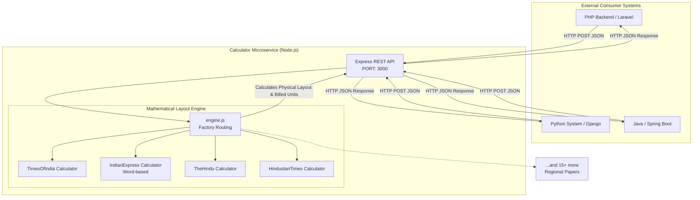

# Intelligent Newspaper Line & Word Calculator API

Welcome to the **Intelligent Line & Word Calculator API**! This project is a powerful, highly accurate backend microservice designed to mathematically simulate the physical layout and print constraints of various major Indian newspapers (Times of India, The Hindu, Indian Express, Hindustan Times, Economic Times, etc.). 

It accurately processes newspaper-specific fonts, proportional character widths, drop-caps, and kerning rules to predict the exact physical lines an advertisement will take in print, and calculates the precise number of billed units (words or lines) required for invoicing.

---

## 🏛 Architecture Diagram

The system is built as a highly portable **RESTful microservice** utilizing Node.js and Express.



---

## 🚀 Setup & Installation Guide

Setting up this project on any server or local machine is extremely simple.

### Prerequisites
- **Node.js** (v14 or higher)
- **npm** (comes installed with Node.js)

### Installation Steps
1. **Clone or download** the project to your local machine or server.
2. Open your terminal/command prompt and navigate to the project directory:
   ```bash
   cd Line_Soft
   ```
3. Install the required Node.js dependencies (`express` and `cors`):
   ```bash
   npm install
   ```

### Running the Server
To start the API server, simply run:
```bash
npm start
```
You should see the message: `Universal Line Calculator API running at http://localhost:3000`. The service is now ready to receive requests!

---

## 🔌 Using the API (Integration Guide)

Because the project is exposed as a **Standard REST API (JSON over HTTP)**, it acts as a "Plug-and-Play" system. Any programming language or framework capable of making an HTTP request can communicate perfectly with this engine.

### **Endpoint Details**
- **URL**: `http://localhost:3000/api/calculate`
- **Method**: `POST`
- **Headers**: `Content-Type: application/json`

### **Request Payload**
Send a JSON body with the following structure:
```json
{
  "newspaper": "hindu",
  "adText": "WANTED: HOUSEKEEPER Full-Time. (Male/Female)",
  "boldWords": ["WANTED:"]
}
```
*Note: The `newspaper` field accepts keys like `toi`, `hindu`, `ie`, `et`, `ht`, `mirror`, `lokmat`, etc.*

---

## 💻 Integration Examples

Here are copy-paste examples to integrate this API into existing PHP or Python systems.

### 🐘 1. PHP Integration Example
Using PHP's native `file_get_contents`:

```php
<?php
// The ad data
$data = array(
    'newspaper' => 'ie',
    'adText' => 'Sale-of-property in USA for 20000 dollars. Call 9876543210.',
    'boldWords' => array('Sale-of-property')
);

// Setup the HTTP POST request
$options = array(
    'http' => array(
        'header'  => "Content-type: application/json\r\n",
        'method'  => 'POST',
        'content' => json_encode($data)
    )
);

// Execute the request
$context  = stream_context_create($options);
$result = file_get_contents('http://localhost:3000/api/calculate', false, $context);

if ($result === FALSE) {
    die('Error connecting to the Calculator API');
}

// Decode and use the result
$response = json_decode($result, true);

if ($response['success']) {
    if ($response['calculationType'] === 'words') {
        echo "Total Billed Words: " . $response['billedWords'];
    } else {
        echo "Total Billed Lines: " . $response['billedLines'];
    }
    echo " (Estimated Physical Print Lines: " . $response['physicalLines'] . ")";
}
?>
```

### 🐍 2. Python Integration Example
Using Python's `requests` library:

```python
import requests

url = 'http://localhost:3000/api/calculate'
payload = {
    'newspaper': 'hindu',
    'adText': 'WANTED: HOUSEKEEPER Full-Time. (Male/Female)',
    'boldWords': ['WANTED:']
}

try:
    response = requests.post(url, json=payload)
    response.raise_for_status() # Check for HTTP errors
    data = response.json()
    
    if data.get('success'):
        print(f"Newspaper: {data['newspaper']}")
        print(f"Physical Layout Lines: {data['physicalLines']}")
        
        if data['calculationType'] == 'lines':
            print(f"Lines to Bill the Customer: {data['billedLines']}")
        else:
            print(f"Words to Bill the Customer: {data['billedWords']}")
            
except requests.exceptions.RequestException as e:
    print(f"API Error: {e}")
```

### 🌐 3. Client-Side JavaScript Example
If you want to query the backend API directly from a React, Vue, or Vanilla JS frontend:

```javascript
async function fetchCalculation() {
    const response = await fetch('http://localhost:3000/api/calculate', {
        method: 'POST',
        headers: { 'Content-Type': 'application/json' },
        body: JSON.stringify({
            newspaper: 'toi',
            adText: 'Property for sale at MG Road.',
            boldWords: []
        })
    });
    
    const data = await response.json();
    console.log("Calculated Billed Lines:", data.billedLines);
}
```

---

## 📊 Understanding the Response

The API automatically detects whether the newspaper relies on **Word-based** or **Line-based** billing logic and formats the response accordingly.

**Example Response for a Line-Based Paper (Times of India):**
```json
{
  "success": true,
  "newspaper": "toi",
  "physicalLines": 3,
  "ratePerLine": 24,
  "calculationType": "lines",
  "billedWords": null,
  "billedLines": 4,
  "layoutDetails": [
    [{"text": "Property", "isBold": false}, {"text": "for", "isBold": false}],
    [{"text": "sale", "isBold": false}, {"text": "at", "isBold": false}],
    [{"text": "MG", "isBold": false}, {"text": "Road.", "isBold": false}]
  ]
}
```

### Key Response Fields:
- `physicalLines`: The exact number of layout lines this ad will occupy in the physical newspaper print.
- `calculationType`: Returns either `"lines"` or `"words"` letting your external system know exactly what to invoice.
- `billedLines` / `billedWords`: The final calculated units to bill the customer based on the mathematical threshold of that specific newspaper.
- `layoutDetails`: An array outlining the exact line-by-line wrapping calculations (useful for debugging or visualizing the ad on a frontend UI).
